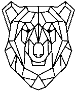
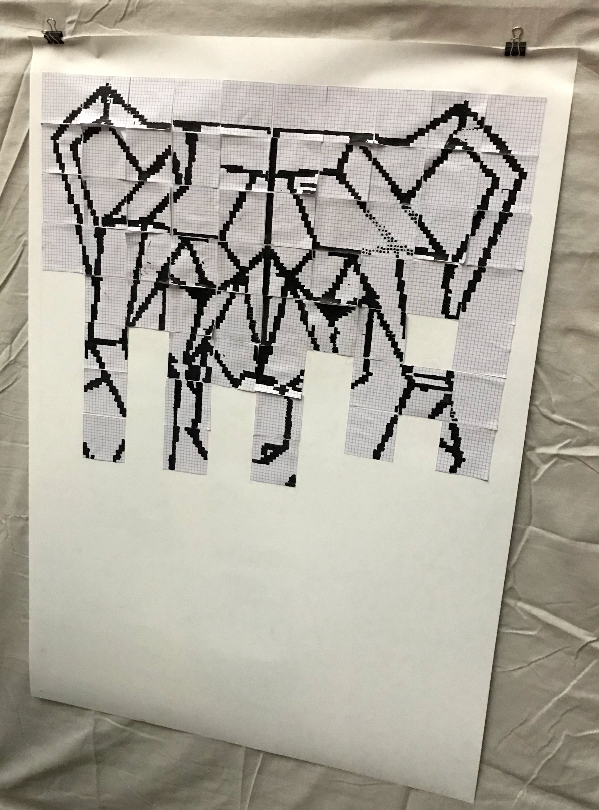

Ce répertoire contient du code python pour générer des pdfs qui 
correspondent à des exercices de décodage.
Un grande image est découpée en tuiles qui sont codées en run-length.
La convention consiste à commencer par mentionner le nombre de blanc, suivi du nombre de noirs, etc... pour chaque ligne.
Une fiche d'explications est fournie dans le [répertoire](../codages-run-lengths).

Cette activité a été testée à la Fête de la Science 2018.

Le fichier [mosaique.py](mosaique.py) contient les sources python.
Les pdfs contiennent les [codes](ours-aime-science_codes.pdf) et les [solutions](ours-aime-science_solutions.pdf) pour l'exemple suivant:

Le fichier [quadrillage.pdf](quadrillage.pdf) fournit des quadrillages vierges en plus en cas d'erreur.

